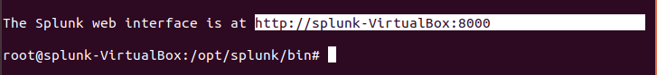

## SIEM Day 2: How To Start Splunk
--------

## Instructions 

-------

1. Start by logging into the Ubuntu VM.	

    * username: `splunk`

    * password: `splunk`

2. Change to the `root` user and enter your password.

    * Run: `sudo su`    

3. Splunk is executed from the **/opt/splunk/bin directory**.

    *  Run: `./splunk start`

### Launching the Splunk Web Interface

4. Copy the **Splunk web interface URL**

    

5. Enter the URL in a web browser in the VM to launch the Web Interface.  

    

6. Enter your `admin` username and password.

    * username: `splunkadmin`

    * password: `splunkadmin`

    

You're now ready to start using Splunk! 