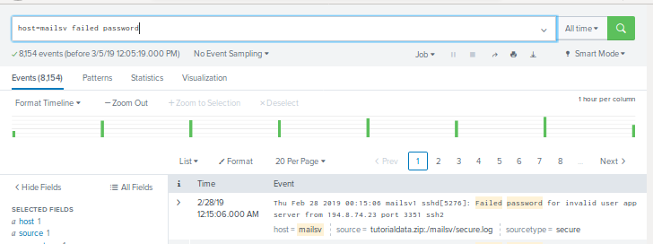
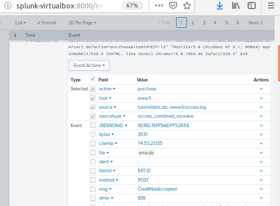

## SIEMs Day 2: Guided Practice - Warm-Up Exercise
--------

## Solution

-------

Splunk Web Interface Searches for Web Performance and Threat Detection

####  Why: Checking web site performance issues.

1. `sourcetype=access_* AND (status=500 OR status=404)`

    This search monitors for **servers internal errors** or **pages not found errors** on all servers.

      

#### Why: Investigating possible password cracking.

2. `host=mailsv failed password`

    This search looks for password attempts on the mail server host in the **secure.log** file .

     

#### Why: Tracking down specific information for requests made to the buttercupgames site.

3. `host=www* useragent=*`

    This search can be used to analyze a request header.  The User-agent Header contains the application type, operating system, software vendor or software version of the requesting software user agent. We are conducting the investigation on all www hosts.

    

#### Why: Investigating possible credit card fraud.

4. `"?msg=Credit*" AND file="error.do" AND host!=www2`

    This search return the purchase date, purchase item id, user agent and client IP address for transactions on all hosts except www2.

    

5. Sample Event Fields and Values returned from the Credit Card Search.

    