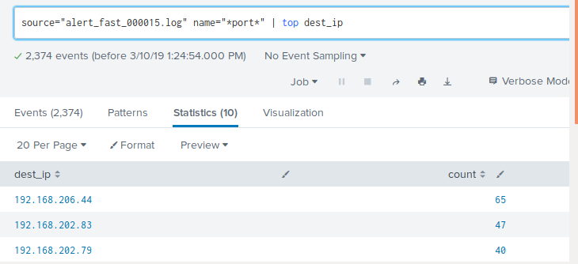
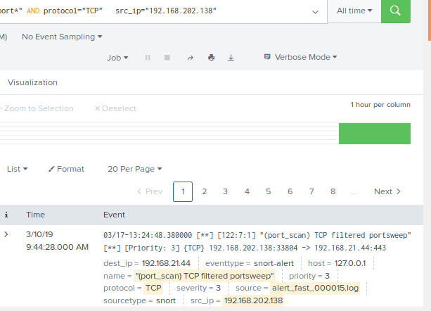
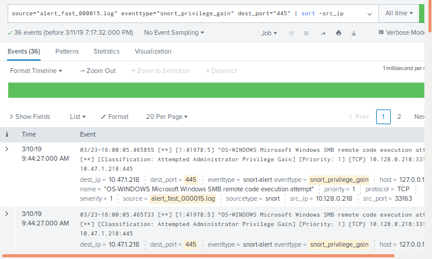

## SIEMs Day 2: Guided Practice - Using Pipes with Splunk
--------

## Solutions

-------

Review with students that **port scanning** is a technique to find active ports to exploit a known vulnerability.  This topic was covered in earlier classes.

### Question 1.

*Create a search that will find all alerts for port scanning activity. Display results for the top `destination IP addresses`.* 

  * The search command is: 
  
    ```bash
      source=alert_fast_000015.log name="*port*" | top dest_ip 
    ```

    

  * How many search results were returned from the `top` command?

    * **Answer**: The `top` command returns the first `10` search results by default.

  * `View the events` for the `top` three IPs.  What **type of port scans** were performed?

    * **Answer**:

    * IP address `192.168.206.44 - TCP Port scan`

    * IP address `192.168.202.83 - TCP Port scan`

    * IP address `192.168.202.79 - ICMP Port scan`


Now, narrow **this search** so that it only includes the `TCP port scans` for the `top five` source IP addresses. Show **ONLY the number** of search results.

  * This search command uses the **logical AND operator** and **two pipes**.

    ```bash
        source=alert_fast_000015.log name="*port*" AND protocol="TCP" | top limit=5 src_ip | fields - percent 
    ```

      

  * `View the events` for the **first IP address**. 

  * `Locate` the **first** event.

  * What `port` is being investigated at the `source IP`? How can this port be used in an attack? 

       
  
      * **Answer:** The Port is **443**. Sample attacks are `buffer overflows`, `trojans` and other vulnerabilities. See the discussion at https://www.speedguide.net/port.php?port=443.


### Question 2.

*Find all instances of **remote code execution**. Narrow your search for all instances where the destination port is 445. **Sort** by the `destination IP` in `descending` order.*

  * This search command uses the **sort command** and **one pipe**.

    ```bash
      source=alert_fast_000015.log eventtype="snort_privilege_gain" dest_port="445" | sort -dest_ip
    ```
      

  * What `priority` and `eventtype` is returned for this search?

    * **Answer:** Priority=`1` and Eventtype=`snort_privilege_gain`

  * What are the `source IP` and `destination IP` addresses?

    * **Answer:** src_IP = `10.128.0.210:33025`  and dest_IP = `10.47.3.218:445`
  
  * Go to the `SNORT Sid database` and write down the details for the alert.

    * **Answer:** This details for the alert is searched using the text string **OS-WINDOWS Microsoft Windows SMB remote code execution attempt** at https://www.snort.org/docs/

    * **Answer:** Alert description is located at https://www.snort.org/rule_docs/1-49174. 

  * How can `port 445` be used by an attacker?  

    * **Answer:**  Attacks by different `worm variants`, `buffer overviews` and other vulnerabilites. See the discussion at https://www.speedguide.net/port.php?port=445.
