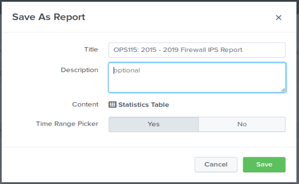

## SIEMS Day 3:  Guided Practice - Generating a Statistical Report from Firewall Attack Logs
--------

## Solution

--------

Here are the solutions to the exercises.

1. What are the **years** for the attack data?

   **Answer:** `2015 - 2019 (3 years 10 months)`

2. What is the **attack name**?

   **Answer:** `Oracle.9i,TNS.OneByte.Dos`

3. Use the [NIST National Vulnerability Database](<https://nvd.nist.gov/vuln/detail/CVE-2002-0509>), "What does the attack do?"

   **Answer:** 

   `Description: The Transparent Network Substrate (TNS) Listener in Oracle 9i 9.0.1.1 allows remote attackers to cause a denial of service (CPU consumption) via a single malformed TCP packet to port 1521.`

4. What **port** does the attack target?

   **Answer:** `1521`

5. What field contains the year(s) for the attack?

   **Answer:** `date_year`

6. What field contains the month(s) for the attack?

   **Answer:** `date_month`

7. What field contains the attack name?

   **Answer:** `attack_name`

8. Using this information, create a SPL search command that searches the firewall IPS event logs `using the attack name` and returns:

* the *count of attacks* by **year** and **month**

* then *sorts the counts* in descending order

* Execute the search using `All Time`.

### A quick way to populate the attack name

* Populate the search using `attack_name` by first clicking the name in the `Selected Fields` panel. 

* Next, click the attack_name under the **Value** title.

   `attack_name="Oracle.9i,TNS.OneByte.Dos"`

* Add the SPL `stats` and `sort` command:

    ` | stats count by date_year, date_month | sort - count`

   **Answer:**

   

9. Create the Statistical Report

- Title = `OPS115: 2015 - 2019 Firewall IPS Report`

   

10. Find and Display the Report in the `Reports` list. 

  * Select the Report tab located in the App bar.

   * Click the Report Title (`OPS115: 2015 - 2019 Firewall IPS Report`) and Open in Search.

   

11. Review the **Extra Challenge:**

* How would you obtain the total number of attacks for each month for each year in the attack log?

   

   **Answer:** change the sort to `sort - date_month`

12. **Ask students:** What month(s) and year(s) had the most attacks.

      **Answer:** `October 2018` and `January 2019`

Great job.  Activity complete!
